## 🐶About Me

#### Hi, I'm Tommy, A Taiwanese🇹🇼 student at the Institute of Computer Science & Information Engineering, National Taiwan University.

    

## 🏫Education
* #### National Taiwan University - Master of Computer Science & Information Engineering
* #### National Chiao Tung University - Bachelor of Computer Science

## 🛠Languages and Tools

             

## 📈GitHub Stats

    

    

    

    

    

## 📱Contact me

